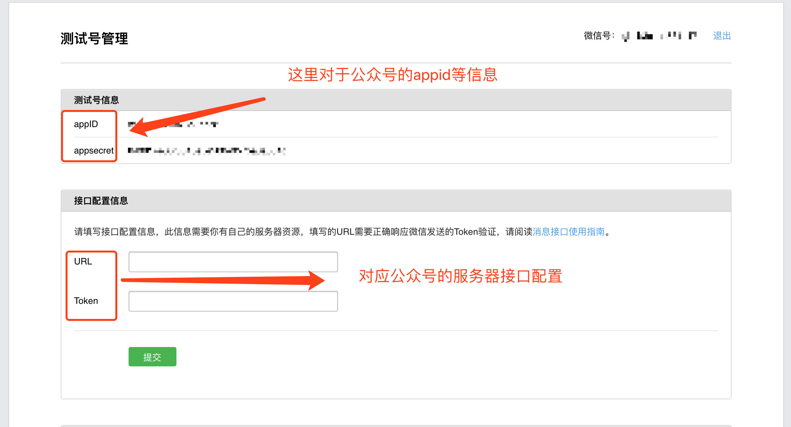
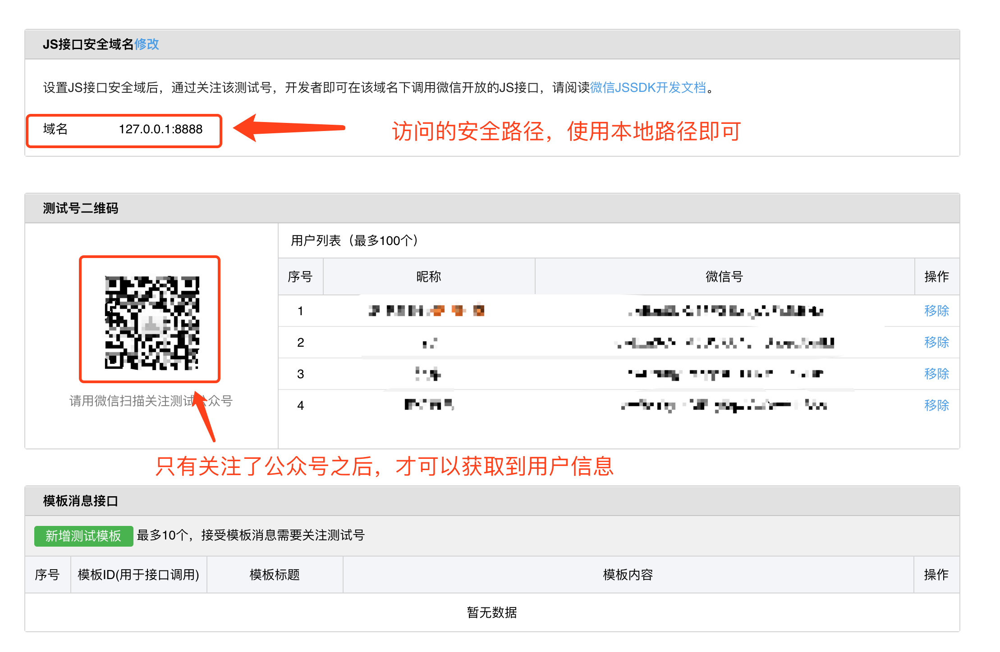
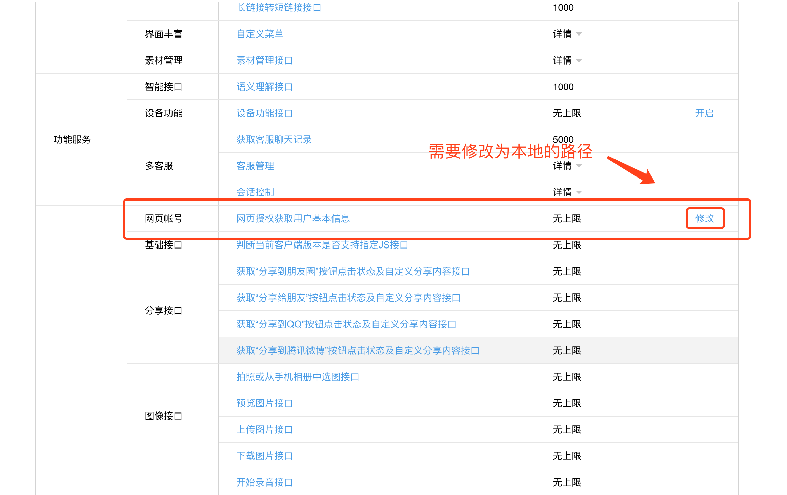
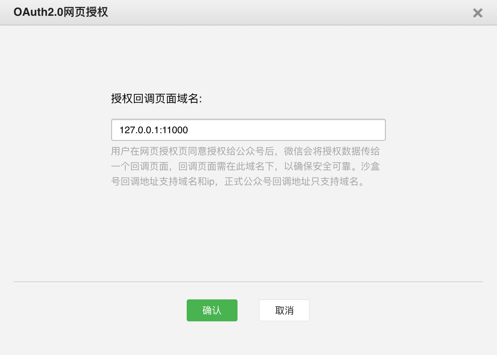

# 微信公众号网页授权

浅析微信支付系列已经更新三篇了哟～，没有看过的朋友们可以看一下哦。

[浅析微信支付：开发前的准备](https://mp.weixin.qq.com/s/mkxukWU4aMw92NxnL91dng)

[浅析微信支付：前篇大纲](https://mp.weixin.qq.com/s/pH0GGwUANJxJt-YHs6y_pQ)

[浅析微信支付：微信支付简单介绍（小程序、公众号、App、H5）](https://mp.weixin.qq.com/s/h9Mx4IBik0MLKSj4c_Qolg)

#### 1、开发前的准备

首先，如果没有看过本系列 `浅析微信支付：开发前的准备` 的朋友需要看一下这篇文章，链接在上方；本文需要用到开发前准备中的几个知识点：设置安全、设置白名单、得到公众号一系列信息（appid\apiKey等）；如果需要在本地开发测试，还需要下载 `微信开发者工具`和 `微信公众平台接口测试帐号` 。

下面我们开始进入开发阶段。

#### 2、设置测试号相关信息

因为项目在开发阶段的时候，需要本地调试，所以需要使用测试号来验证代码是否正确，所以下面会讲如何设置测试号相关配置；

首先我们进入 [微信公众平台接口测试帐号申请](https://mp.weixin.qq.com/debug/cgi-bin/sandbox?t=sandbox/login) 页面，点击登录即可使用微信账号登录（一个微信号只有一个测试号）。

登录后可以进入测试号管理界面，如下：

 





 



 



按要求设置上方图片中的配置，即可减少80%的问题，如果调用时还有其他问题，请到文末添加作为微信，可进入讨论群和大家一起交流。

#### 3、获取微信网页授权

使用以下代码获取微信网页授权：

微信官方js文件：

```text
<script src="http://res.wx.qq.com/open/js/jweixin-1.2.0.js" type="text/javascript"></script>
```

封装的微信工具文件`weixin_util.js`：

```text
<script type="text/javascript">

// 微信默认设置配置方法
function weixinConfig(appid, timestamp, noncestr, signature) {
    wx.config({
        debug : false, // 开启调试模式,调用的所有api的返回值会在客户端alert出来，若要查看传入的参数，可以在pc端打开，参数信息会通过log打出，仅在pc端时才会打印。
        // debug : true, 
        appId :appid, // 必填，公众号的唯一标识
        timestamp : timestamp, // 必填，生成签名的时间戳
        nonceStr : noncestr, // 必填，生成签名的随机串
        signature : signature,// 必填，签名，见附录1
        jsApiList: [
            'checkJsApi',
            'onMenuShareTimeline',
            'onMenuShareAppMessage',
            'onMenuShareQQ',
            'onMenuShareWeibo',
            'hideMenuItems',
            'showMenuItems',
            'hideAllNonBaseMenuItem',
            'showAllNonBaseMenuItem',
            'chooseWXPay',
        ]
        // 必填，需要使用的JS接口列表，所有JS接口列表见附录2
    });
}

// 获取用户的openid
function getBaseInfo(userId, state){
    if (userId === '') {
        //1.获取到code
        $appid="xxx";
        $redirect_uri=encodeURI("http://127.0.0.1:8888/weixin/auth/authorize.do");//这里的地址需要http://
        $url="https://open.weixin.qq.com/connect/oauth2/authorize?appid="+$appid+"&redirect_uri="+$redirect_uri+"&response_type=code&scope=snsapi_userinfo&state=" + state + "#wechat_redirect";
        window.location.href = $url;
    }
}
</script>
```

调用微信config方法并获取网页授权：

```text
<script type="text/javascript">

    // 微信功能配置
    weixinConfig('${appid}',${timestamp},'${noncestr}','${signature}');

    // 用户授权登陆
    getBaseInfo('${(userId)}' ,'redirect_uri');

</script>
```

如果访问页面路径，得到以下显示，就已经成功获取网页授权，其他均为失败： 

如果出现其他错误，需要检查一下第一步时设置的路径安全接口、域名是否正确，开启weixinConfig中的debug模式，看是否为没有正确设置功能模块；如果还不能解决，请到文末看楼主上一篇文章或者添加作者进群即可。

#### 4、获取微信用户信息

这里说一下上面获取用户授权的具体参数：

第一步，获取config需要的基础参数：

```text
/**
 * 根据appid获取wx.config需要的基础参数
 * @param reqMap requestUrl 请求页面地址、appid appid
 * @return json
 *
 * @author yclimb
 * @date 2018/9/25
 */
@ApiOperation(value = "微信公众号|config需要的基础参数", httpMethod = "POST", notes = "config需要的基础参数")
@PostMapping("/getSignature")
public AppMessage getSignature(@RequestBody Map<String, String> reqMap) {
    Map<String, Object> map = Maps.newHashMap();
    switch (reqMap.get("appid")) {
        case WXPayConstants.APP_ID:
            map = wxUtils.getSignature(reqMap.get("requestUrl"), reqMap.get("appid"), BaseConstants.WX_MINI_PROGRAM_YUEDIAN_CODE);
            break;
        case WXPayConstants.APP_ID_CHUNBO:
            map = wxUtils.getSignature(reqMap.get("requestUrl"), reqMap.get("appid"), BaseConstants.WX_CHUNBO_JSAPI_YUEDIAN_CODE);
            break;
    }
    return AppMessage.success(map);
}
```

第二部分：获取用户授权的基础信息：

```text
// 这里的appid就是咋们测试号的appid
$appid="xxx";

// 这里的地址需要http://且必须encodeURI，此地址为获取用户信息后，微信自动转发的服务器端接口，用来接收微信的授权code，在后端处理而得到用户基本信息
$redirect_uri=encodeURI("http://127.0.0.1:8888/weixin/auth/authorize.do");

// 微信官方的授权接口
$url="https://open.weixin.qq.com/connect/oauth2/authorize?appid="+$appid+"&redirect_uri="+$redirect_uri+"&response_type=code&scope=snsapi_userinfo&state=" + state + "#wechat_redirect";

// state可以用来区分特殊参数和配置
```

具体可见微信官方文档，文档如下：[微信网页授权接口](https://mp.weixin.qq.com/wiki?t=resource/res_main&id=mp1421140842)

以上为js页面处理，下面我们来具体讲解 redirect\_uri 这个接口中需要处理的逻辑；

`WXAuthController`：

```text
/**
 * 微信网页授权
 * https://mp.weixin.qq.com/wiki?t=resource/res_main&id=mp1421140842
 * 第一步：用户同意授权，获取code
 * 第二步：通过code换取网页授权access_token
 * @return str
 *
 * @author yclimb
 * @date 2018/7/30
 */
@ApiOperation(value = "微信用户|网页授权", httpMethod = "GET", notes = "获取前端微信用户的网页授权，得到用户基础信息")
@GetMapping("/authorize")
public AppMessage authorize(HttpServletRequest request) {

    // 跳转页面标识
    String state = request.getParameter("state");
    // 通过code获取access_token
    String code = request.getParameter("code");
    log.info("authorize:code:{}", code);

    String appid;
    String secret;

    // 根据不同的state得到不同的微信公众号网页授权
    switch (state) {
        case STATE_ASYD:
            appid = WXPayConstants.APP_ID_ASYD;
            secret = WXPayConstants.SECRET_ASYD;
            break;
        default:
            appid = WXPayConstants.APP_ID_CHUNBO;
            secret = WXPayConstants.SECRET_CHUNBO;
            break;
    }

    // 获取access_token和openid
    JSONObject jsonToken = wxUtils.getJsapiAccessTokenByCode(code, appid, secret);
    if (null == jsonToken) {
        return AppMessage.error(-2);
    }

    return AppMessage.success(jsonToken);
}
```

`WXUtils`：

```text
/**
 * 网页授权获取用户信息时用于获取access_token以及openid
 * 请求路径：https://api.weixin.qq.com/sns/oauth2/access_token?appid=APPID&secret=SECRET&code=CODE&grant_type=authorization_code(最后一个参数不变)
 *
 * @param code c
 * @return access_token json obj
 * @author yclimb
 * @date 2018/7/30
 */
public JSONObject getJsapiAccessTokenByCode(String code, String appid, String secret) {
    if (StringUtils.isBlank(code)) {
        return null;
    }
    try {
        // 获取access_token
        String access_token_json = restTemplate.getForObject(WeChatURL.OAUTH_ACCESS_TOKEN_URL, String.class, appid, secret, code);
        logger.info("getJsapiAccessTokenByCode:access_token_json:{}", access_token_json);
        if (StringUtils.isBlank(access_token_json)) {
            return null;
        }
        JSONObject jsonObject = JSON.parseObject(access_token_json);
        if (StringUtils.isBlank(jsonObject.getString("access_token"))) {
            return null;
        }
        return jsonObject;
    } catch (Exception e) {
        logger.error(e.getMessage(), e);
    }
    return null;
}
```

使用以上方法就可以得到微信用户的基础咯～，上面是作者已经封装好的sdk方法，具体的源码请见文末源码地址。

如果用户已经授权，第二次进入网页，这时候不需要再次授权，作者也提供了另一种获取用户信息的方法，通过access\_token和openid请求获取用户信息，代码如下：

```text
/**
 * 通过access_token和openid请求获取用户信息
 * @return str
 *
 * @author yclimb
 * @date 2018/9/17
 */
@ApiOperation(value = "微信用户|通过access_token和openid请求获取用户信息", httpMethod = "POST", notes = "通过access_token和openid请求获取用户信息")
@PostMapping("/getXxxUser/{access_token}/{openid}")
public AppMessage getXxxUser(@PathVariable String access_token, @PathVariable String openid) {

    // 通过access_token和openid请求获取用户信息
    JSONObject jsonUserinfo = wxUtils.getJsapiUserinfo(access_token, openid);
    if (null == jsonUserinfo) {
        return AppMessage.error(-2);
    }

    // 判断用户是否在悦店系统中是一个用户
    String unionid = jsonUserinfo.getString("unionid");
    if (StringUtils.isBlank(unionid)) {
        return AppMessage.error(61008);
    }

    // 存储用户信息到数据库

    // 用户名称解码
    user.setNickName(UserNickUtil.decodeNickName(user.getNickName()));

    return AppMessage.success(user);
}
```

#### 结语

根据以上步骤实现，就可以完成微信授权-用户信息获取等操作，如果有问题，欢迎小伙伴随时交流～

预告：下一篇文章，作者将讲 `统一下单接口`，敬请期待！！！

​如果想要提前一览源码的小伙伴，可以先看看我的 github，地址如下： `https://github.com/YClimb/wxpay-sdk/blob/master/README.md`

加作者私人微信，作者微信号如下 `yclimb`，标明 `微信支付` 可拉入微信支付讨论群与小伙伴一起探讨哦，一定要标明 `微信支付` 哦～

到此本文就结束了，关注公众号查看更多推送！！！


