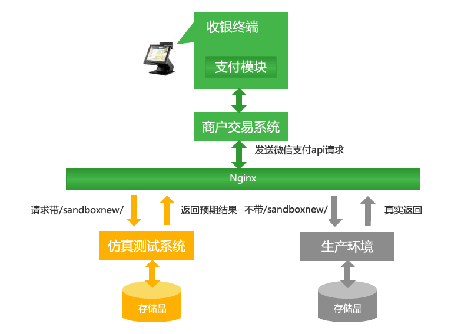
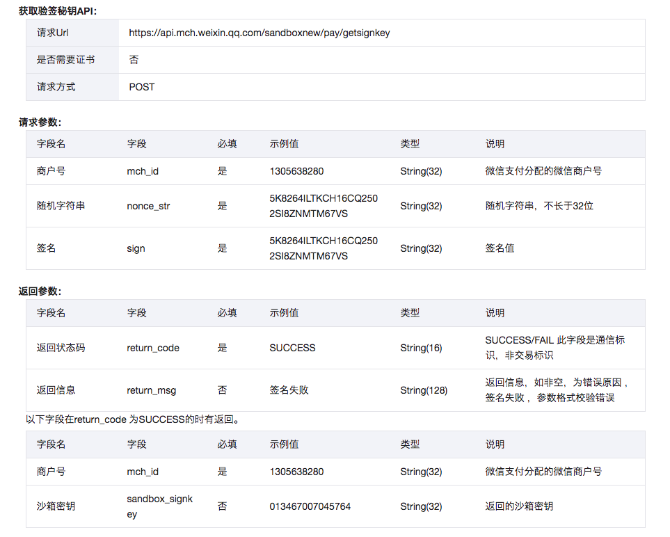

# 如何使用沙箱环境测试

浅析微信支付系列已经更新十篇了哟～，没有看过的朋友们可以看一下。

[浅析微信支付：下载对账单和资金账单](https://mp.weixin.qq.com/s/XCR1Ts-uabuC573_vLb3Qg)

[浅析微信支付：申请退款、退款回调接口、查询退款](https://mp.weixin.qq.com/s/IyWjWB__-VsqKO8SL0DL3Q)

[浅析微信支付：查询订单和关闭订单](https://mp.weixin.qq.com/s/SG4sTHsUKKJF-_Qgpjh0jA)

[浅析微信支付：支付结果通知](https://mp.weixin.qq.com/s/Zr3ldgsMIg_cBrtuS2c7_g)

在实际开发中，通常我们都是在开发环境中开发，本地环境也有很多限制，比如：微信支付无法调起、H5链接需要鉴权、支付结果通知需要外网等。

面对以上的问题，微信官方给出了解决的方法，就是咋们这篇文章的 `沙箱环境`，也就是微信支付的官方测试环境，这个环境能做些什么呢？我觉得最重要的一点就是我们可以实时根据官方的例子调用对应的接口，并且接口会马上返回结果，拿微信支付预支付单接口来说，调用以后会实时返回我们支付的相关信息，这样就免于开发时不知道返回结果而苦恼。

#### 仿真测试系统

为降低商户测试门槛，微信支付团队开发了一套独立的仿真测试系统。该系统根据验收用例金额的不同返回不同的响应报文，以满足商户正常功能测试、安全/异常测试及性能测试的需求。



图1为微信支付仿真测试系统（后简称仿真系统）的简化原理图。仿真系统的API协议与正式API完全相同（API接口文档）。商户开发者只需将正式API的调用URL增加一层`sandboxnew`路径，即可对接到仿真系统。

例如，刷卡支付URL：[https://api.mch.weixin.qq.com/pay/micropay](https://api.mch.weixin.qq.com/pay/micropay) 变更为：[https://api.mch.weixin.qq.com/sandboxnew/pay/micropay。](https://api.mch.weixin.qq.com/sandboxnew/pay/micropay。)

仿真系统与生产环境完全独立，包括存储层。商户在仿真系统所做的所有交易（如下单、支付、查询）均为无资金流的假数据，即：用户无需真实扣款，商户也不会有资金入账。代金券同理，沙箱环境中无需商户真实制券与发券，亦不会出现真实扣券情况。验收仿真测试系统的API验签密钥需从API获取:



#### 源码&交互过程

以下为微信官方的`仿真测试系统`文档：

```text
https://pay.weixin.qq.com/wiki/doc/api/jsapi.php?chapter=23_1
```

上面说明具体的交互过程和相关的仿真测试系统的API验证签名，为什么需要这个签名接口呢？这是因为使用 `沙箱环境` 时使用的是真实的`商户号`、`小程序/公众号APP_ID`，但是 `API密钥`这个参数必须使用 `沙箱环境` 的 `sandbox_signkey`，此接口主要是取得这个参数。

注：仿真测试环境中的商户号（父子商户号）需使用真实商户号。

下面为取得 `sandbox_signkey`的示例：

```text
/**
 * 获取沙盒 sandbox_signkey
 *
 * @author yclimb
 * @date 2018/9/18
 */
private void doGetSandboxSignKey() throws Exception {
    WXPayConfigImpl config = WXPayConfigImpl.getInstance();
    HashMap<String, String> data = new HashMap<String, String>();
    // 商户号
    data.put("mch_id", config.getMchID());
    // 获取随机字符串
    data.put("nonce_str", WXPayUtil.generateNonceStr());
    // 生成签名
    String sign = WXPayUtil.generateSignature(data, config.getKey());
    data.put("sign", sign);

    // 得到 sandbox_signkey
    WXPay wxPay = new WXPay(config);
    String result = wxPay.requestWithoutCert("/sandboxnew/pay/getsignkey", data, 10000, 10000);
    System.out.println(result);
}
```

小伙伴可以根据 `result` 来获取具体的返回数据，解析之后获取 `sandbox_signkey`参数。

商户接入仿真系统的交互流程示例： 1. 商户发起刷卡支付请求，使用POST方式调用 [https://api.mch.weixin.qq.com/sandboxnew/pay/micropay](https://api.mch.weixin.qq.com/sandboxnew/pay/micropay) 2. 带sandboxnew 的https请求会被nginx路由到仿真系统。仿真系统根据支付金额（total\_fee字段）返回预期报文给商户。同时，落地该笔请求数据； 3. 商户发起查单，调用 [https://api.mch.weixin.qq.com/sandboxnew/pay/orderquery，带上微信订单号（transaction\_id）或商户内部单号（out\_trade\_no）；](https://api.mch.weixin.qq.com/sandboxnew/pay/orderquery，带上微信订单号（transaction_id）或商户内部单号（out_trade_no）；) 4. 仿真系统收到查单请求后，根据单号及金额返回预期的查单结果给商户； 5. 商户下载对账单，调用 [https://api.mch.weixin.qq.com/sandboxnew/pay/downloadbill](https://api.mch.weixin.qq.com/sandboxnew/pay/downloadbill) ，仿真系统返回固定的账单格式给商户。注：账单内容不一定与商户在仿真系统产生的交易完全相同。

沙箱说明：sandbox/sandboxnew 微信支付沙箱环境，是提供给微信支付商户的开发者，用于模拟支付及回调通知。以验证商户是否理解回调通知、账单格式，以及是否对异常做了正确的处理。 ◆ 如何对接沙箱环境？ 1、修改商户自有程序或配置中，微信支付api的链接，如：被扫支付官网的url为：[https://api.mch.weixin.qq.com/pay/micropay](https://api.mch.weixin.qq.com/pay/micropay) 增加sandboxnew路径，变更为[https://api.mch.weixin.qq.com/sandboxnew/pay/micropay](https://api.mch.weixin.qq.com/sandboxnew/pay/micropay) ， 即可接入沙箱验收环境，其它接口类似； 2、在微信支付开发调试站点（站点链接：[http://mch.weixin.qq.com/wiki/doc/api/index.php](http://mch.weixin.qq.com/wiki/doc/api/index.php) ），按接口文档填入正确的支付参数，发起微信支付请求，完成支付； 3、验收完成后，修改程序或配置中的api链接（重要！），去掉sandboxnew路径。对接现网环境。

说明地址： [https://pay.weixin.qq.com/wiki/doc/api/jsapi.php?chapter=23\_1](https://pay.weixin.qq.com/wiki/doc/api/jsapi.php?chapter=23_1) [https://pay.weixin.qq.com/wiki/doc/api/app/app.php?chapter=21\_2](https://pay.weixin.qq.com/wiki/doc/api/app/app.php?chapter=21_2)

#### 结语

其实 `沙箱环境`主要是为了方便在开发时及时获得接口返回值和进行 `商户支付验收`使用，本文讲了如何获取 `sandbox_signkey`参数，然后如何进行模拟对接，在实际接口URL后增加 `sandboxnew` 即可，接口会实时返回结果参数，此点于正式环境不同（正式环境支付后是异步调用，沙箱环境是实时返回）。

注意：有的接口沙箱环境的接口并不只是在链接中增加 `sandboxnew`，整个链接都会改变，在实际操作中我们应该查看官方文档一一对照，如支付退款接口，正式线接口为：`/secapi/pay/refund`，而沙箱环境接口为：`/sandboxnew/pay/refund`，在沙箱环境中去掉了 `secapi` 这一路径，请小伙伴一定要注意。

预告：为了更好的验证微信支付安全性，我们需要接入微信的 `验收测试`，下一篇文章 `支付验收示例和验收指引` 为大家讲解，敬请期待！！！

​如果想要提前一览源码的小伙伴，可以先看看我的 github，地址如下： ​ ​`​https://github.com/YClimb/wxpay-sdk/blob/master/README.md ​`

加作者私人微信，作者微信号如下 `yclimb`，标明 `微信支付` 可拉入微信支付讨论群与小伙伴一起探讨哦，一定要标明 `微信支付` 哦～

到此本文就结束了，关注公众号查看更多推送！！！


